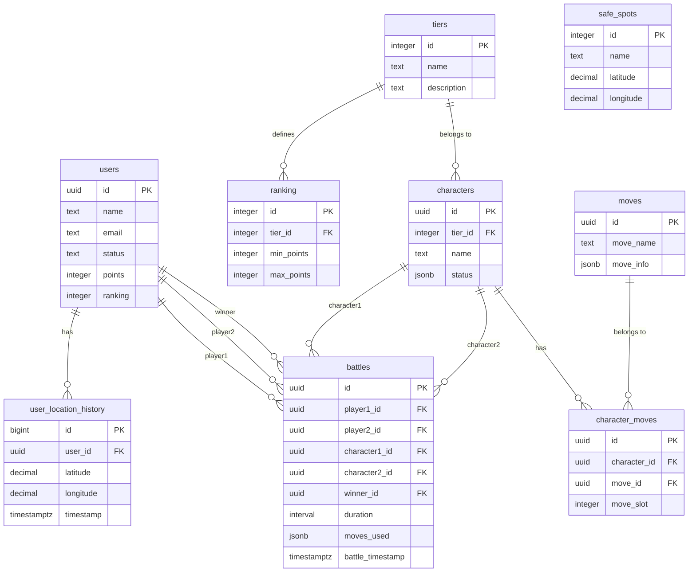

# Data Model - Relational Database (PostgreSQL/Supabase)

This document describes the architecture of the project's relational database (PostgreSQL), managed via Supabase. The model is designed to be normalized, scalable, and secure, ensuring data integrity and query performance.

## Architecture and Technology Choices

-   **Primary Database**: PostgreSQL (via Supabase) was chosen for its robustness, relational capabilities, support for extensions (like PostGIS), and the integrated features of Supabase, such as authentication and automated APIs.
-   **Real-time Location Data**: For tracking the *current* location of users, which requires constant updates and high-speed reads, the architecture plans for the use of a NoSQL database like MongoDB.
-   **Location History**: The history of user movements is stored in PostgreSQL to enable complex relational analysis, integration with other system data, and auditing.

## Entity-Relationship Diagram (ERD)



## Table Schema Breakdown

Below is a detailed breakdown of each table, including the SQL code for its creation.

-----

### 1\. `users`

Stores the essential data for each user registered in the system.

| Column | Data Type | Description |
| :--- | :--- | :--- |
| `id` | `uuid` | **Primary Key.** UUID for uniqueness and integration with Supabase Auth. |
| `name` | `text` | The user's full name. Cannot be null. |
| `email` | `text` | The user's email address. Must be unique. |
| `password` | `text` | The hashed password. **Important**: managed by Supabase Auth. |
| `points` | `integer` | The user's score. Defaults to 0. Optimized for frequent updates. |
| `ranking` | `integer` | The user's position on the leaderboard. Can be null. |
| `status` | `text` | The account status ('active', 'inactive', 'pending'). Defaults to 'active'. |
| `created_at` | `timestamptz` | The registration timestamp. |

#### Motivation and Design Choices

  - `id` as a UUID facilitates integration with external authentication systems.
  - Keeping `points` and `ranking` in this table speeds up leaderboard queries.
  - `status` allows for user lifecycle management.

-----

### 2\. `tiers`

Defines the levels or ranks for characters and users.

| Column | Data Type | Description |
| :--- | :--- | :--- |
| `id` | `serial` | **Primary Key.** Sequential identifier. |
| `name` | `text` | The name of the tier (e.g., 'S', 'A', 'Bronze'). Must be unique. |
| `description` | `text` | A brief description of what the tier represents. (Optional). |

#### Motivation and Design Choices

  - Centralizes tier definitions, allowing them to be managed dynamically without changing application logic.
  - Ensures consistency, as both the `ranking` and `characters` tables reference this one.

-----

### 3\. `ranking`

Defines the point ranges that determine which tier a user belongs to.

| Column | Data Type | Description |
| :--- | :--- | :--- |
| `id` | `serial` | **Primary Key.** |
| `tier_id` | `integer` | **Foreign Key** to `tiers.id`. |
| `min_points` | `integer` | The minimum score required for this rank. |
| `max_points` | `integer` | The maximum score for this rank. |

#### Motivation and Design Choices

  - Decouples the scoring logic from the application by moving it to the database.
  - Facilitates queries to determine a user's tier based on their points.
  - The relationship with the `tiers` table maintains data integrity.

-----

### 4\. `characters`

Stores the playable characters with their attributes and associated tier.

| Column | Data Type | Description |
| :--- | :--- | :--- |
| `id` | `uuid` | **Primary Key.** Unique character identifier. |
| `tier_id` | `integer` | **Foreign Key** to `tiers.id`, indicating the character's strength. |
| `name` | `text` | The character's name. Must be unique. |
| `status` | `jsonb` | Character attributes stored as JSON (agility, strength, hp, defense). |

#### Motivation and Design Choices

  - **JSONB for flexibility**: Character attributes are stored as JSONB to allow easy addition of new stats without schema changes.
  - **PostgreSQL JSONB benefits**: Efficient storage, indexing with GIN, and powerful querying capabilities.
  - The association with `tiers` provides a clear and manageable indication of each character's relative power.
  - **Example status structure**: `{"agility": 15, "strength": 25, "hp": 100, "defense": 20}`

-----

### 5\. `battles`

Records the complete history of every battle that occurred between users.

| Column | Data Type | Description |
| :--- | :--- | :--- |
| `id` | `uuid` | **Primary Key.** Unique battle identifier. |
| `player1_id` | `uuid` | **Foreign Key** to `users.id`. |
| `player2_id` | `uuid` | **Foreign Key** to `users.id`. |
| `character1_id` | `uuid` | **Foreign Key** to `characters.id` used by player 1. |
| `character2_id` | `uuid` | **Foreign Key** to `characters.id` used by player 2. |
| `winner_id` | `uuid` | **Foreign Key** to `users.id`. Can be null in case of a draw. |
| `duration` | `interval` | The duration of the battle (e.g., '00:05:30'). |
| `moves_used` | `jsonb` | JSONB array tracking moves used by each character during the battle. |
| `battle_timestamp` | `timestamptz`| The timestamp of when the battle took place. |

#### Motivation and Design Choices

  - Essential for player history, calculating statistics (win-rate, etc.), and auditing.
  - The granular data allows for future game balancing analysis.
  - The `interval` type is optimized for duration calculations and analysis.

-----

### 6\. `safe_spots`

Stores the geographic coordinates of safe locations on the game map.

| Column | Data Type | Description |
| :--- | :--- | :--- |
| `id` | `serial` | **Primary Key.** |
| `name` | `text` | The name of the safe spot (e.g., 'Alpha Base'). |
| `latitude` | `decimal(9,6)` | The latitude coordinate with high precision. |
| `longitude`| `decimal(9,6)` | The longitude coordinate with high precision. |
| `created_at` | `timestamptz` | The timestamp when the location was registered. |

#### Motivation and Design Choices

  - A simple and efficient structure for in-game logic.
  - Using the `decimal` type is preferable to `float` for coordinates, as it avoids rounding issues.
  - **Alternative**: For advanced geographical features (e.g., "find all spots within a 5km radius"), the **PostGIS** extension would be the next step.

-----

### 7\. `user_location_history`

Maintains a record of all locations a user has visited.

| Column | Data Type | Description |
| :--- | :--- | :--- |
| `id` | `bigserial` | **Primary Key.** `bigserial` is used as this table can grow very large. |
| `user_id` | `uuid` | **Foreign Key** to `users.id`. |
| `latitude` | `decimal(9,6)` | The latitude coordinate. |
| `longitude`| `decimal(9,6)` | The longitude coordinate. |
| `timestamp` | `timestamptz` | The exact timestamp when the location was recorded. |

#### Motivation and Design Choices

  - Enables movement analysis, pattern detection, and route replays.
  - Storing the history in PostgreSQL allows `JOINs` with other tables (users, battles) for rich, contextual analysis.
  - The separation of *current* location (in MongoDB) and *history* (in PostgreSQL) is a strategic decision to optimize performance for frequent writes and analytical reads.

-----

### 8\. `moves`

Stores all available moves that characters can learn and use in battles.

| Column | Data Type | Description |
| :--- | :--- | :--- |
| `id` | `uuid` | **Primary Key.** Unique move identifier. |
| `move_name` | `text` | The name of the move (e.g., 'Thunderbolt', 'Fire Blast'). |
| `move_info` | `jsonb` | JSONB object containing move details like type, power, accuracy, PP, etc. |
| `created_at` | `timestamptz` | The timestamp when the move was added to the system. |

#### Motivation and Design Choices

  - JSONB format allows flexible storage of move attributes without rigid schema constraints.
  - Enables easy querying and filtering of moves by type, power, or other attributes.
  - Supports future expansion of move properties without schema changes.

-----

### 9\. `character_moves`

Junction table establishing the many-to-many relationship between characters and their available moves.

| Column | Data Type | Description |
| :--- | :--- | :--- |
| `id` | `uuid` | **Primary Key.** Unique relationship identifier. |
| `character_id` | `uuid` | **Foreign Key** to `characters.id`. |
| `move_id` | `uuid` | **Foreign Key** to `moves.id`. |
| `move_slot` | `integer` | The slot position (1-4) where the move is equipped. |
| `created_at` | `timestamptz` | The timestamp when the move was assigned to the character. |

#### Motivation and Design Choices

  - Implements the classic Pokemon-style move system where each character can have up to 4 moves.
  - Unique constraints ensure no duplicate moves per character and only one move per slot.
  - Supports dynamic move learning and forgetting mechanics.
  - Enables battle system to validate move usage and track move history.

<!-- end list -->
```